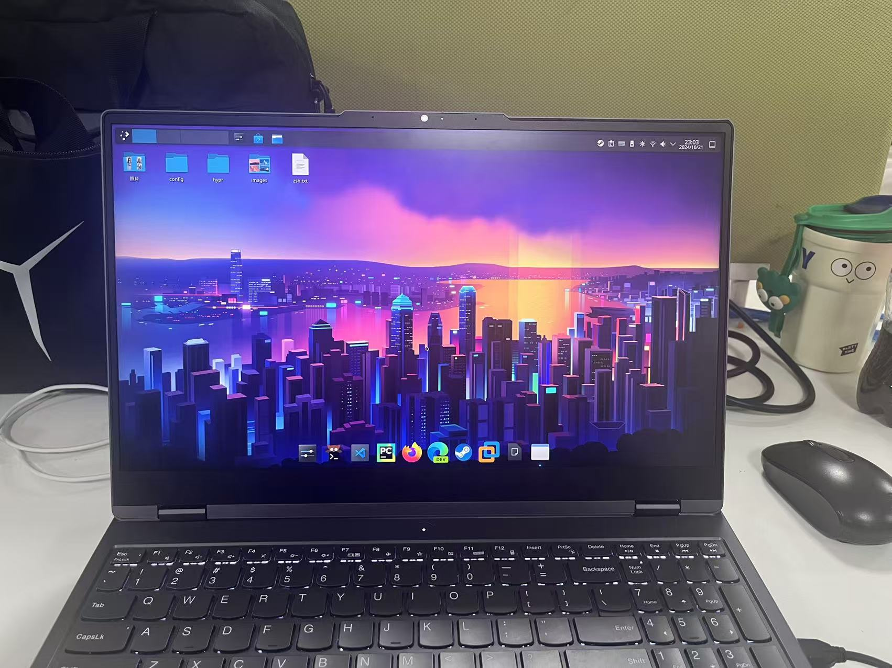
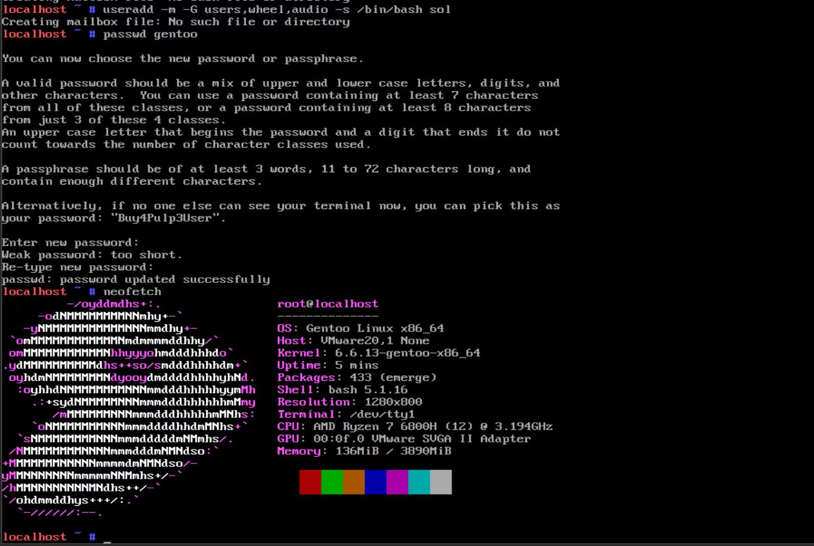
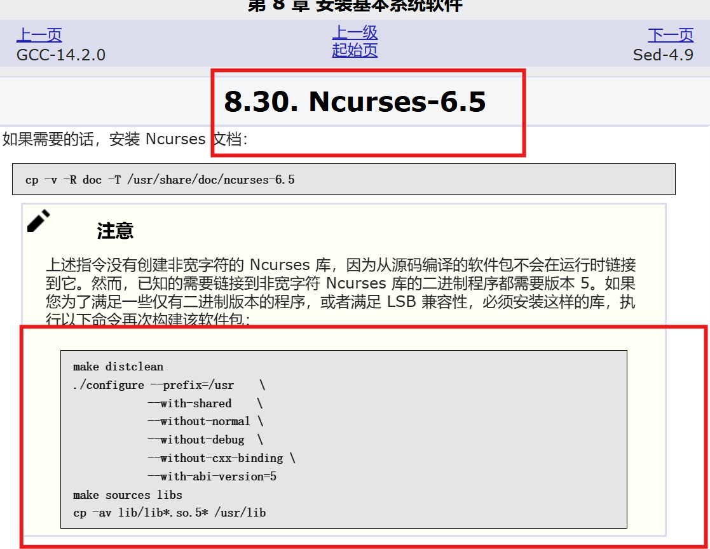
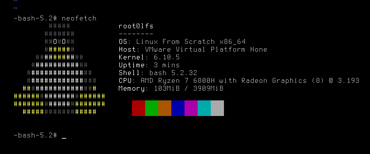

**Linux From Scratch **

我和 "linux" 的经历

在两年半前，刚上大一，第一次接触linux，那会是centos7，感觉虚拟机挺好玩，自己在虚拟机里面安装了ubuntu

家里的台式机性能太差，还是我八九岁那时候买的联想家悦系列，安装ubuntu卡死了

后来慢慢的接触debian系列的gnu/linux，有了一定的基础，在两年前自己试着没有使用arch-install安装archlinux

后来在一年半前的暑假，因为家里网不好，我在实体机上第N次安装了ARCH并且安装桌面环境(使用了hyprland和kde双桌面，后续一直备份在硬盘里面，当时当过一端时间主流系统，前任照片还在，现在偶尔会插上硬盘看看前任照片)

然后就是在去年过年，开始学习gentoo

gentoo就是为了lfs做准备的，之后紧接着就是编译lfs

编译lfs有个非常需要注意的地方，看图，这里一定要写上

最后功夫不负有心人

现在懒得捣鼓这些，系统换回来windows，linux也是用debian和centos7比较多

